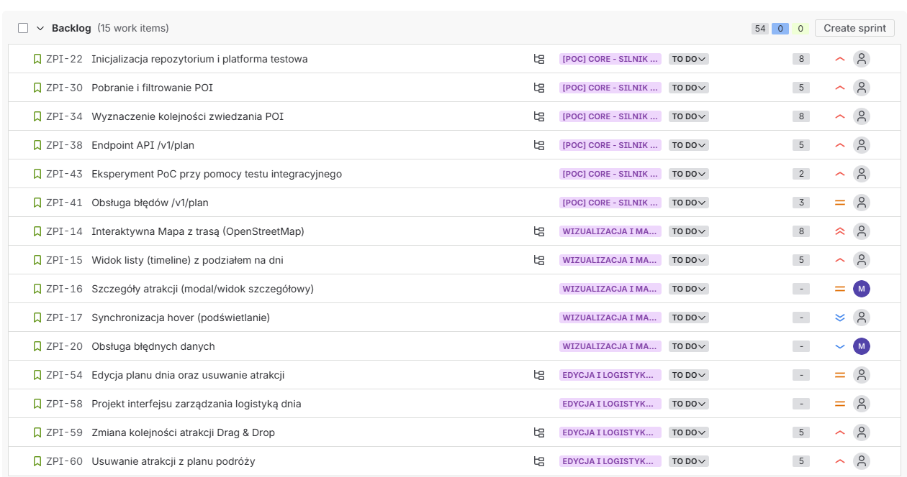
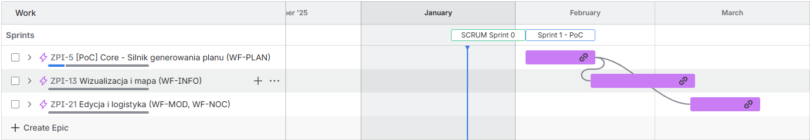
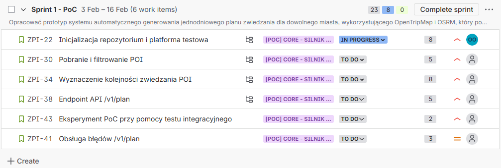
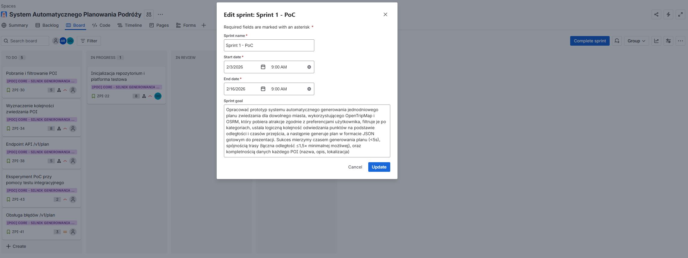

## 1. Wstęp

### 1.1 Cel dokumentu
Celem niniejszego raportu jest przedstawienie:
- transformacji wymagań z SRS na Product Backlog (epiki → historyjki → zadania),
- roadmapy (oś czasu) obejmującej zakres **MVP** na semestr,
- szczegółowego planu **Sprintu 1** (2 tygodnie), skoncentrowanego na **PoC** kluczowej funkcjonalności.

### 1.2 Definicje i skróty
- **Epic** – duży obszar funkcjonalny / cel biznesowy.
- **User Story** – historyjka użytkownika w formacie „Jako…, chcę…, aby…”.  
- **PoC (Proof of Concept)** – minimalny prototyp do weryfikacji hipotezy wykonalności.
- **DoD (Definition of Done)** – wspólne kryteria ukończenia pracy.

---

## 2. Część A – Product Backlog i Roadmapa

### 2.1 Epiki (MVP)
| ID | Epic | Opis (1–2 zdania) | Priorytet |
|----|------|-------------------|:---------:|
| ZPI&#8209;5 | Core – Silnik generowania planu (WF-PLAN) | Epik obejmuje implementację kluczowego silnika aplikacji odpowiedzialnego za automatyczne generowanie harmonogramu zwiedzania na podstawie parametrów wejściowych użytkownika oraz danych z otwartych źródeł. Stanowi fundament systemu i jest realizowany w pierwszej kolejności jako Proof of Concept. | High |
| ZPI&#8209;13 | Wizualizacja planu i mapa (WF-INFO) | Epik koncentruje się na czytelnej prezentacji wygenerowanego planu podróży w formie listy chronologicznej oraz interaktywnej mapy, umożliwiającej podgląd atrakcji i ich lokalizacji. | Medium |
| ZPI&#8209;21 | Edycja planu i logistyka podróży (WF-MOD, WF-NOC) | Epik obejmuje podstawowe mechanizmy edycji wygenerowanego planu oraz obsługę logistyki dnia, takie jak usuwanie i przenoszenie atrakcji oraz start i koniec dnia z placeholderami noclegowymi. | Medium |

### Backlog produktu (Jira)


*Rys. 1. Widok Product Backlog w narzędziu Jira z podziałem na epiki i historyjki użytkownika.*


### 2.2 Roadmapa (oś czasu – tylko epiki)


*Rys. 2. Widok Timeline Epików w narzędziu Jira.*

## 3. Część B – Planowanie Sprintu 1 (2 tygodnie) na podstawie PoC

### 3.1 Opis PoC
### PoC 1 – Automatyczne pobranie atrakcji i ułożenie trasy (core algorytmu)

#### Hipoteza
Da się automatycznie:
- Pobrać atrakcje z OpenTripMap dla miasta,
- Ułożyć je w logicznej kolejności zwiedzania na podstawie odległości (routing),
- Zrobić z tego sensowny jednodniowy plan w formie od atrakcji do atrakcji, gdzie każda atrakcja zawiera opis

#### Co sprawdzamy technicznie
- Czy API OpenTripMap daje wystarczająco dobre dane (POI, kategorie, współrzędne),
- Czy da się szybko policzyć kolejność zwiedzania (np. najbliższy sąsiad / OSRM),
- Czy wynik jest użyteczny (czas, dystans, kolejność).

#### Minimalny prototyp (opis koncepcji)
Backend (np. Python/Java):
- Endpoint: `/v1/plan?city=Rome&tags=museum,park`

Odpowiedź endpointu (pojedynczy POI):
```json
{
  "name": "Colosseum",
  "description": "Ancient Roman amphitheater",
  "lat": 41.8902,
  "lon": 12.4922,
  "order": 1,
  "distance_to_next": 450
}
```

Kroki:
1. Zapytanie do OpenTripMap → lista POI
2. Filtrowanie po tagach
3. Wywołanie OSRM (Open Source Routing Machine) → macierz odległości między POI
4. Prosty algorytm kolejności (nearest neighbor) w oparciu o macierz odległości z wywołania OSRM
5. Zwrócenie JSON: lista punktów w kolejności + dystanse (odpowiedź API)

#### Eksperyment
- Wejście: Rzym, 1 dzień, preferencje „muzea”
- Mierzymy lub zapisujemy:
  1. Czas odpowiedzi
  2. Odpowiedź API (JSON)
  3. Całkowitą długość trasy

Dla każdego wywołania wyliczamy minimalną sumę odległości ze zwróconych punktów - wywołanie powtarzamy N razy (np. 1000). Przy okazji sprawdzamy, czy za każdym razem uzyskane są wszystkie atrybuty w odpowiedzi API.

#### Kryteria sukcesu
Dla każdego wywołania:
- Plan generuje się **< 5s**
- Gdy całkowita długość trasy nie przekracza 1,5-krotności minimalnej możliwej sumy odległości potrzebnej do połączenia wszystkich wybranych atrakcji w jedną spójną strukturę (minimalne drzewo rozpinające), przy założeniu, że każda para atrakcji ma znaną odległość między sobą.
- Każdy punkt ma **nazwę, opis i lokalizację**

#### Możliwe scenariusze i decyzje
- **Scenariusz pozytywny:** Plan generuje się szybko, trasa jest logiczna, wszystkie POI mają poprawne dane.  
  **Decyzja:** PoC udany → dalszy rozwój (np. UI, lepszy algorytm optymalizacji trasy).
- **Scenariusz częściowo udany:** Plan działa, ale czas jest zbyt długi lub trasa nie zawsze logiczna.  
  **Decyzja:** usprawnienia algorytmu, limit POI, lepsze filtrowanie, optymalizacja wywołań OSRM.
- **Scenariusz negatywny:** Plan nie generuje się poprawnie lub OTM/OSRM nie dostarcza danych.  
  **Decyzja:** zmiana źródła danych, modyfikacja podejścia do routingu, ewentualne zawieszenie projektu.

---

### 3.2 Cel Sprintu (SMART)
**Cel sprintu (SMART):**  
„W ciągu jednego sprintu opracować prototyp systemu automatycznego generowania jednodniowego planu zwiedzania dla dowolnego miasta, wykorzystującego OpenTripMap i OSRM, który pobiera atrakcje zgodnie z preferencjami użytkownika, filtruje je po kategoriach, ustala logiczną kolejność odwiedzania punktów na podstawie odległości i czasów przejścia, a następnie generuje plan w formacie JSON gotowym do prezentacji. Sukces mierzymy czasem generowania planu (<5s), spójnością trasy (łączna odległość ≤1,5× minimalnej możliwej), oraz kompletnością danych każdego POI (nazwa, opis, lokalizacja).”

### 3.3 Tablica sprintu


*Rys. 3. Widok pierwszego Sprintu w narzędziu Jira.*


*Rys. 4. Widok celu biznesowego Sprintu w narzędziu Jira.*

### 3.4 Definition of Done (DoD)

**Epik:** PoC Core - silnik generowania planu (WF-PLAN)

---

#### 1. Kryteria Funkcjonalne
- **Pobieranie i filtrowanie danych:** System poprawnie pobiera dane POI i aplikuje filtry po tagach.
- **Logika tworzenia trasy:** Algorytm wyznacza optymalną kolejność zwiedzania z uwzględnieniem geolokalizacji i okien czasowych (PoC: trasa ≤1,5× minimalnej).
- **Parametry trasy:** Każdy wygenerowany plan zawiera szacowany czas dotarcia i czas pobytu w POI.

#### 2. Warstwa API (v1/plan)
- **Endpoint:** Interfejs `/v1/plan` przyjmuje żądania i zwraca poprawną strukturę danych JSON zawierającą POI w odpowiedniej kolejności zwiedzania.
- **Obsługa błędów (ZPI-41):** System zwraca kody 4xx/5xx w przypadku braku danych, błędnych parametrów lub awarii silnika.
- **Dokumentacja:** Kontrakt API jest opisany w standardzie OpenAPI/Swagger.

#### 3. Walidacja Techniczna i Jakość
- **Integracja:** Testy integracyjne przechodzą pomyślnie w środowisku deweloperskim.
- **Jakość kodu:** Kod przeszedł procedurę Code Review i nie zawiera krytycznych błędów.
- **Testy:** Pokrycie testami jednostkowymi kluczowej logiki algorytmu wynosi min. 80%.

#### 4. Akceptacja Końcowa
- Kod został scalony do gałęzi głównej.
- Funkcjonalność została zweryfikowana i zaakceptowana przez osobę decyzyjną.

**Epik:** Prezentacja harmonogramu i interaktywna mapa (WF-INFO)

---

#### 1. Wygląd i Działanie (UI/UX)
- **Mapa:** Interaktywna mapa (OpenStreetMap) poprawnie wyświetla trasę zwiedzania i wszystkie punkty (POI).
- **Lista:** Harmonogram jest czytelny, podzielony na konkretne dni i ułożony chronologicznie (oś czasu).
- **Szczegóły:** Po kliknięciu w atrakcję pojawia się okno lub widok z opisem i zdjęciami miejsca.
- **Synchronizacja:** najechanie myszką na element listy podświetla odpowiadający mu punkt na mapie (i na odwrót).
- **Responsywność:** Widok mapy i listy dopasowuje się do ekranu telefonu i komputera.

#### 2. Obsługa Danych i Błędów
- **Błędne dane:** Jeśli system otrzyma niepełne dane (np. brak współrzędnych POI), wyświetla komunikat o błędzie zamiast "rozsypanego" widoku.
- **Weryfikacja wizualna:** Na mapie widać gołym okiem, że atrakcje są blisko siebie (zgodnie z logiką geograficzną).

#### 3. Jakość Techniczna
- **Kontrola kodu:** Przynajmniej dwie osoby z zespołu sprawdziły kod pod kątem błędów i czytelności.
- **Czystość zapisu:** Kod nie zawiera niepotrzebnych powtórzeń i jest zgodny z przyjętymi standardami zespołu.
- **Wydajność:** Mapa ładuje się płynnie, a przełączanie między dniami nie powoduje zawieszania aplikacji.

#### 4. Akceptacja Końcowa
- Funkcjonalność została przetestowana na różnych urządzeniach (telefon, laptop).
- Wszystkie zmiany zostały zapisane w głównym folderze projektu.
- Wynik prac został pokazany i zaakceptowany przez osobę decyzyjną.


**Epik:** Mechanizmy modyfikacji planu i zarządzanie logistyką (WF-MOD, WF-NOC)

---

#### 1. Funkcje edycji (WF-MOD)
- **Zmiana kolejności:** Użytkownik może swobodnie zmieniać kolejność atrakcji, a system ponownie tworzy trasę zwiedzania.
- **Usuwanie:** Użytkownik może usunąć niechcianą atrakcję z planu dnia.
- **Pełna kontrola:** Po edycji plan pozostaje spójny i użytkownik ma nad nim pełną władzę.

#### 2. Zarządzanie logistyką (WF-NOC)
- **Ramy dnia:** Użytkownik może zdefiniować godzinę startu i zakończenia zwiedzania każdego dnia.
- **Obsługa noclegów:** System pozwala na wskazanie miejsca noclegu (start/koniec dnia w konkretnym punkcie).
-  **Placeholder:** Interfejs pozwala zarezerwować czas na nieplanowane aktywności.

#### 3. Jakość techniczna i środowisko
- **Stabilność:** Edycja planu nie powoduje błędów w działaniu mapy ani harmonogramu.
- **Przegląd:** Kod przeszedł przegląd pod kątem logiki przeliczania trasy po zmianach użytkownika.

#### 4. Akceptacja Końcowa
- **Testy użytkownika:** Sprawdzono, czy przesuwanie i usuwanie elementów jest intuicyjne i szybkie.
- **Wdrożenie:** Wszystkie funkcje są scalone z głównym kodem projektu.
- **Zatwierdzenie:** Funkcje edycji i logistyki zostały zaakceptowane przez osobę decyzyjną.


## 4. Pre-Mortem dla PoC (ryzyka + plan zapobiegawczy)


### 4.1 Scenariusz porażki
System odpowiada po 12 sekundach dla zapytania ?city=Rome&tags=museum,food. Wygenerowany JSON zawiera 5 punktów, gdize dwa z nich mają nazwę "null", a jeden to muzeum oddalone o 10 km od centrum (błąd filtrowania geograficznego) oraz kolejność zwiedzania wymusza na turyście trzykrotne przekraczanie Tybru (błąd algorytmu). Po trzecim zapytaniu API OpenTripMap zwraca błąd 429 (Too Many Requests). PoC zostaje uznane za porażkę.

### 4.2 Identyfikacja przyczyn porażki

Na podstawie notatek oraz analizy technicznej, zidentyfikowano następujące przyczyny, które doprowadziły do powyższego scenariusza:

A. Problemy z danymi i zależnościami zewnętrznymi (OpenTripMap/OSRM):
1.  Niespójność danych wejściowych: API OpenTripMap zwraca obiekty o różnej strukturze (brakujące pola `opening_hours`, `description`, `name`). System nie potrafił obsłużyć braku danych, co skutkowało pustymi polami w JSON.
2.  Odmowa dostępu: skrypt testowy zablokował dostęp do API OpenTripMap ze względu na brak zaimplementowanego mechanizmu spowalniania żądań lub cache'owania.
3.  Nierozpoznanie kontekstu zasięgu: API zwróciło atrakcje znajdujące się w mieście, ale na peryferiach, co algorytm potraktował równoważnie z centrum miasta.

B. Problemy algorytmiczne i logiczne:
1.  Algorytm wpadł w pułapkę lokalną: prosty algorytm zachłanny wybrał najbliższy punkt, który geograficznie prowadził w ślepą uliczkę, wymuszając daleki powrót do kolejnych atrakcji (problem chaotycznej trasy).
2.  Ignorowanie czynnika czasu: algorytm wytyczył trasę optymalną odległościowo, ale niemożliwą do realizacji (np. punkt zamykany o 14:00 został ustawiony na koniec dnia).
3.  Złożoność obliczeniowa: przy dużej liczbie POI pobranych z OTM, zapytanie o macierz odległości do publicznego API OSRM trwało zbyt długo lub było odrzucane ze względu na wielkość ładunku.

C. Problemy bezpieczeństwa i implementacyjne:
1.  Brak walidacji wejścia: podatność punktu końcowego `/v1/plan` na wstrzyknięcie złośliwych danych w parametrach URL, co przy braku sanityzacji mogło doprowadzić do wycieku danych debugowania.
2.  Dług technologiczny: wybór bibliotek był nieoptymalny (np. synchroniczne zapytania HTTP zamiast asynchronicznych), co wydłużyło czas odpowiedzi.

### 4.3 Omówienie zagrożeń i ich konsekwencji

Zespół przeanalizował zidentyfikowane przyczyny i pogrupował je według krytyczności dla powodzenia PoC:
1.  Krytyczne ryzyko: jeśli OpenTripMap nie dostarczy kategoryzacji lub współrzędnych w przewidywalnym formacie, żaden algorytm nie naprawi planu. Jeśli darmowe dane są zbyt niskiej jakości, założenie biznesowe o niskim koszcie utrzymania upada, bo trzeba płacić za inne API, na co nie ma budżetu.

2.  Wysokie ryzyko: tester odrzuci aplikację, jeśli trasa będzie nielogiczna (zygzakowanie). Algorytm NN może być niewystarczający dla skomplikowanych układów miast. Jeśli PoC wykaże, że NN jest bezużyteczny, a bardziej zaawansowane algorytmy są zbyt wolne, projekt traci sens w obecnym kształcie.

3.  Średnie ryzyko: uzależnienie od zewnętrznych API bez mechanizmów (takich jak Redis) sprawia, że aplikacja jest podatna na awarie dostawców. 
    W kontekście bezpieczeństwa, brak walidacji parametrów wejściowych w PoC może prowadzić do nawyku ignorowania bezpieczeństwa w fazie MVP.

### 4.4 Plan zapobiegawczy

Dla kluczowych zagrożeń opracowano następujące działania zapobiegawcze:

| Obszar | Zagrożenie | Działania zapobiegawcze |
| :--- | :--- | :--- |
| Dane | Niska jakość danych z OTM (braki w opisach, złe lokalizacje). | 1. Implementacja warstwy, która odrzuca POI bez nazwy lub współrzędnych przed przekazaniem do algorytmu.<br>2. Jeśli OTM zwróci pustą listę, użycie zapasowego, statycznego pliku JSON z "Top 10 atrakcji" dla najpopularniejszych miast, aby PoC zawsze coś zwróciło.<br>3. Ograniczenie obszaru wyszukiwania do promienia X km od centrum miasta, aby wyeliminować peryferia. |
| Algorytm | Chaotyczna trasa i przekroczenie czasu 5s. | 1. Ograniczenie liczby punktów: algorytm w PoC przetwarza do 10-15 najlepiej ocenianych POI, a nie wszystkie pobrane. Mniejsza macierz to szybszy OSRM i lepszy wynik NN.<br>2. Wykorzystanie asynchroniczności do równoległego odpytywania API. |
| Infrastruktura | Blokada API i niestabilność. | 1. Cache: implementacja prostego cache'owania odpowiedzi API. Zapytanie kolejny raz o te same dane nie zużywa limitów. |
| Bezpieczeństwo | Wstrzyknięcie kodu/błędów, brak walidacji. | 1. Walidacja parametrów: ścisłe sprawdzanie typów parametrów wejściowych (np. `lat`/`lon` muszą być float, `tags` tylko z dozwolonej listy).<br>2. Obsługa błędów: zwracanie generycznych komunikatów błędów, aby nie ujawniać za dużo informacji. |


## 5. Załączniki

### 5.1 Linki
- [**Jira projekt**](https://zpi-zad3.atlassian.net/jira/software/projects/ZPI/summary)
- [**Repozytorium**](https://github.com/xDekann/zpi-lab)
